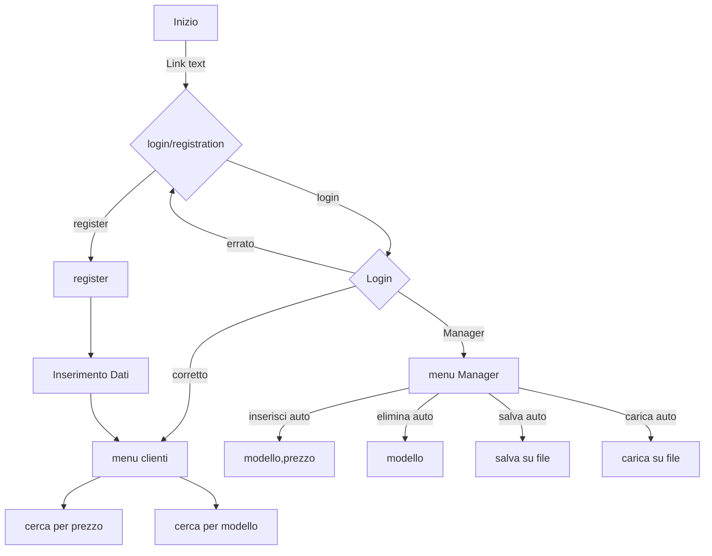

## Autonoleggio TerzaFila

Il progetto consente la gestione di un autonoleggio, partendo da una un menù inziale si può accedere direttamente, registrarsi od uscire dall'applicazione .

    Scegli un'opzione:    
	1 Accedi
  2 Registrati
_____________________________
	0. Esci

Siete una software house e venite incaricati di sviluppare un autonoleggio. questo autonoleggio presenta due attori: 
- il manager che può inserire auto 
e rimuoverle (e anche effettuare ricerche)
- il cliente: il cliente può noleggiare un'auto 
(quindi ci sarà uno stato noleggiata a true o false), 
effettuare una ricerca per prezzo o per nome auto. 
una volta che un'auto è noleggiata fino a quando non si restituisce
non può essere noleggiata da qualcun altro.

**Twist**: in realtà questo autonoleggio 
è una base segreta di batman e inserendo il suo nome 
e una password compare la batmobile che non è visibile a nessun altro. Batman può aggiungere o rimuovere nuove batmobili.

ultimissima cosa cercate di gestire anche un login generale e un sistema di registrazione

il 6 come consegna voglio il link e il jar file dell'eseguibile

La ricerca per prezzo deve restituire le auto con quel prezzo o inferirore
